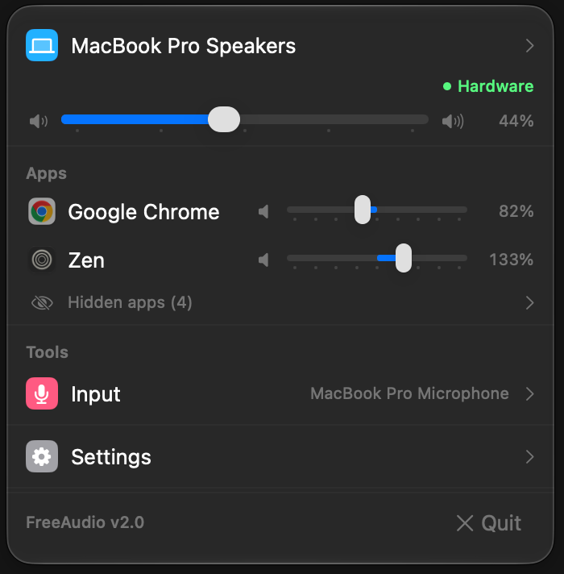

# FreeAudio

> **Free & open-source alternative to [SoundSource](https://rogueamoeba.com/soundsource/)**

SoundSource is a great app, but it's paid. FreeAudio covers its most-used features in a free, open-source macOS menu bar app: a volume slider and mute for every app that plays sound, output device control, and working volume (and volume keys) for HDMI/DisplayPort monitors that macOS can't turn down.

FreeAudio is the sibling of [FreeDisplay](https://github.com/hakanotal/FreeDisplay) and shares its foundation and look.

[Download Latest Release](https://github.com/hakanotal/FreeAudio/releases/latest) | [Report an Issue](https://github.com/hakanotal/FreeAudio/issues)


---

[](https://buymeacoffee.com/hakantotal)

---

## Screenshots

<p align="center">
  
</p>

---

## Features

- **Per-app volume and mute** for every app playing audio: the app slider runs from 0 to 200%, with 100% (unchanged) in the middle. Sliders snap to 0, 25, 50, 75 and 100%. Browser and Electron helper processes are grouped under their app.
- **Remembered per app:** settings apply from the app's first sound, also after a relaunch. Apps left at default are never touched.
- **Output device:** switch outputs, set the output volume and mute.
- **Software volume for monitors:** HDMI/DisplayPort outputs with no hardware volume get a working slider and mute, system sounds included.
- **Volume keys on those outputs,** with a volume HUD; on other outputs the keys behave as usual.
- **Follows your setup:** headphones, AirPods and monitors coming and going, sample-rate changes, sleep and wake.
- **Launch at login** with automatic restart after a crash; quitting or a crash always returns apps to their normal volume.

See the [CHANGELOG](CHANGELOG.md) for details.

---

## What SoundSource Features Does This Replace?

| SoundSource Feature | FreeAudio | Notes |
|---------------------|:---------:|-------|
| Per-app volume | ✅ | Slider per app, remembered by bundle ID |
| Per-app mute | ✅ | Instant, click-free |
| Volume boost | ✅ | App sliders go up to 200%, with a soft limiter against clipping |
| Output device switching | ✅ | Alert sounds follow the output |
| Output volume and mute | ✅ | Hardware volume where the device has it |
| Volume for HDMI/DisplayPort outputs | ✅ | Software volume when macOS greys the slider out ("Use Software Volume" forces it) |
| Volume keys for those outputs | ✅ | 16 steps, Option+Shift for finer steps, own volume HUD |
| Per-app output routing | ✅ | Pick an output per app; falls back to the default while that device is away |
| Input device and level | ✅ | Switch microphones, set the input level and mute |
| Per-app EQ, profiles | ❌ | Not planned: FreeAudio stays simple |
| Level meters | ⏳ | Planned |
| Audio Unit effects | ❌ | Not planned |

### Not Included (intentionally)

- A virtual audio driver: Core Audio process taps (macOS 14.2+) do the job without installing anything system-wide
- Recording and Audio Unit hosting: out of scope

---

## Installation

### Option 1: Download DMG

1. Download the latest `FreeAudio-<version>.dmg` from [Releases](https://github.com/hakanotal/FreeAudio/releases/latest) (Apple silicon, macOS 27+)
2. Open the DMG and drag **FreeAudio.app** to **Applications**
3. First launch: the app isn't notarized, so macOS blocks it once. Open it, then go to **System Settings → Privacy & Security** and click **Open Anyway**, or run:
   ```bash
   xattr -dr com.apple.quarantine /Applications/FreeAudio.app
   ```
4. The first time you change an app's volume, macOS asks for **System Audio Recording** permission. Allow it.

### Option 2: Build from Source

```bash
git clone https://github.com/hakanotal/FreeAudio.git
cd FreeAudio
./scripts/build-dmg.sh   # → build/FreeAudio.app and build/FreeAudio-<version>.dmg
```

Xcode is optional: without it the script builds with the Command Line Tools (`xcode-select --install`). Run the unit tests with `./scripts/test.sh`. With Xcode you can open `FreeAudio.xcodeproj` (regenerate it with `xcodegen generate` after editing `project.yml`).

---

## Permissions

| Permission | Why |
|------------|-----|
| **System Audio Recording** | Per-app volume and software volume work by tapping app audio (Core Audio process taps). Audio is processed live and never recorded or stored |
| **Accessibility** | Only for the volume keys on outputs with software volume |

No internet connection required (except the optional update check via the GitHub Releases API).

---

## How It Works

FreeAudio leaves apps alone until you change one. An app with a non-default setting gets a private Core Audio process tap that mutes its normal playback and hands its audio to FreeAudio, which plays it to the same output at your level. For an output without hardware volume, one more tap carries everything else playing there at the software volume. Taps are private to FreeAudio and disappear when it quits.

---

## Troubleshooting

- **Calls (FaceTime, Zoom, Teams):** while an app is controlled its echo cancellation can't hear its own output. Leave calling apps at 100%.
- **Other audio tools:** apps that also tap audio (SoundSource, FineTune, eqMac and others) interfere with FreeAudio; FreeAudio shows a notice when one is running.
- **An app sounds stuck or silent:** Settings → Audio engine → Restart.

---

## Tech Stack

- **Swift 6** + **SwiftUI** (MenuBarExtra)
- **Core Audio** process taps and private aggregate devices (Swift object API), real-time IOProc with `Atomic` state
- Private APIs (via `dlsym`, with fallbacks): process responsibility (groups WebKit audio under its app), TCC preflight (permission status)
- Zero third-party dependencies

---

## Project Structure

```
FreeAudio/
├── App/        # AppDelegate, app entry point
├── Core/       # Pure, unit-tested logic: grouping, settings, render kernel, engine diff
├── Audio/      # Core Audio layer: taps, aggregates, IOProc, HAL queue
├── Models/     # AudioDevice
├── Services/   # Devices, apps, tap engines, permissions, volume keys, HUD, settings
└── Views/      # Menu bar panel
Tests/          # Swift Testing (./scripts/test.sh)
```

Architecture notes: [docs/ARCHITECTURE.md](docs/ARCHITECTURE.md). Plan: [docs/ROADMAP.md](docs/ROADMAP.md).

---

## Acknowledgements

The engine design learned from [FineTune](https://github.com/ronitsingh10/FineTune), [AudioCap](https://github.com/insidegui/AudioCap), [Mimir](https://github.com/ThalesBMC/Mimir) and MonitorKeys (studied as references; no code was copied).

## License

MIT License. See [LICENSE](LICENSE) for details.
